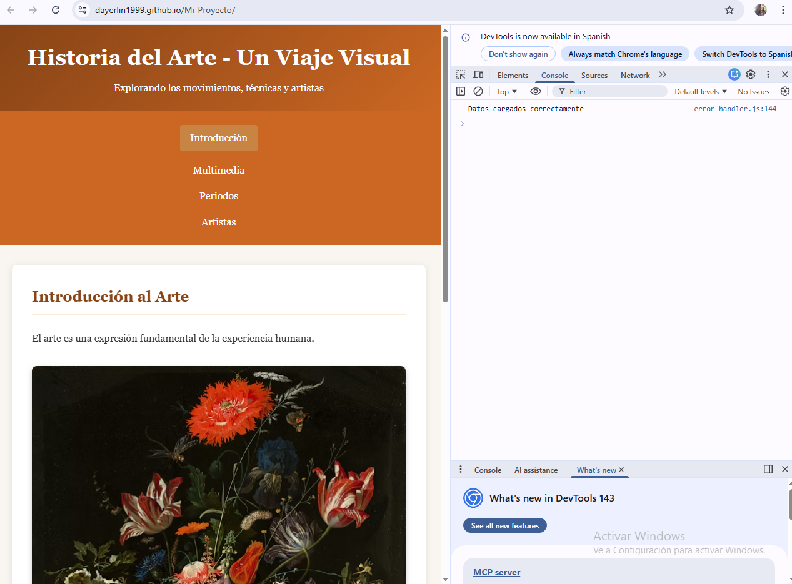
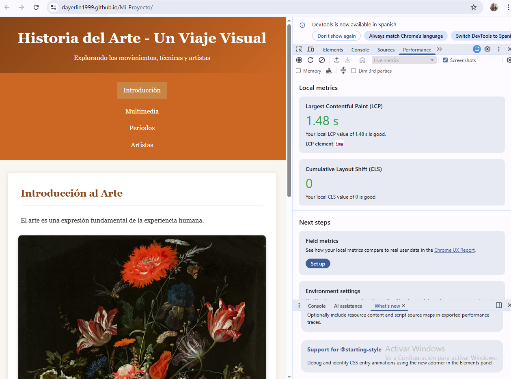

# Historia del Arte - Un Viaje Visual

Sitio web sobre historia del arte con multimedia interactiva.

## Nuevas Funciones
- Audio y video con controles
- Animaciones CSS al cargar
- Canvas para dibujar
- Efectos visuales con scroll

## Tecnologías
- HTML5, CSS3, JavaScript

## 📊 Evaluación Técnica - Capturas DevTools

### 1. Console (Manejo de Errores)

*Manejo de errores con try...catch y promesa simulada controlada.*

### 2. Network (Carga de Recursos)

*Carga optimizada de todos los recursos: HTML, CSS, JS, audio, video e imágenes.*

### 3. Performance (Rendimiento)

*Métricas de rendimiento: LCP 1.48s (bueno) y CLS 0 (sin cambios de layout).*

**Estudiante:** Dayerlin Guerra  
**Matrícula:** 27.0242.283
